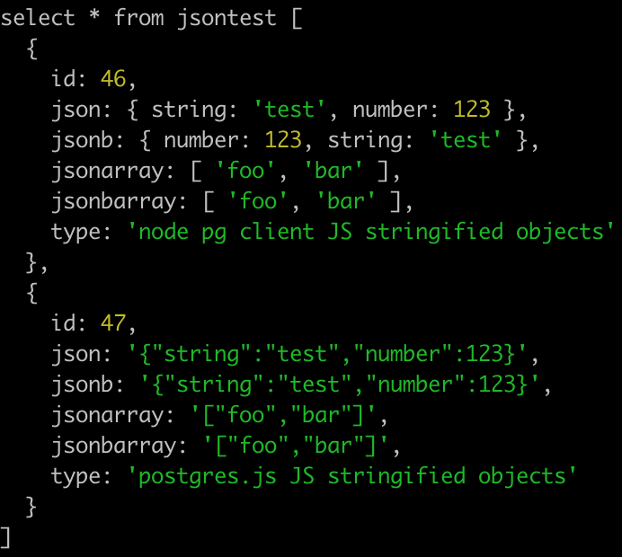
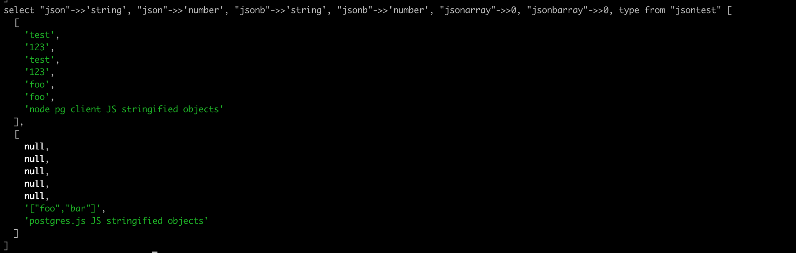

# Postgres.js json behavior

This repo is a demo of how the `postgres` package handles stringified input for JSON/JSONB columns, and how it compares to the `pg` package.

When using stringified objects as parameters to JSON/JSONB columns, `pg` properly sets these in JSON and JSONB columns as objects. However, `postgres` instead sets these as JSON/JSONB strings, which means things like the `->>` and `->` operators do not work properly.

